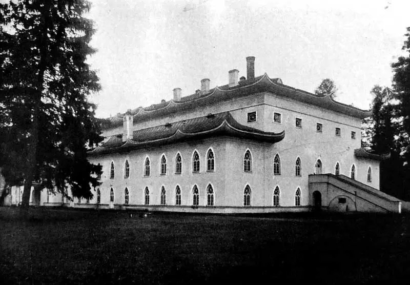
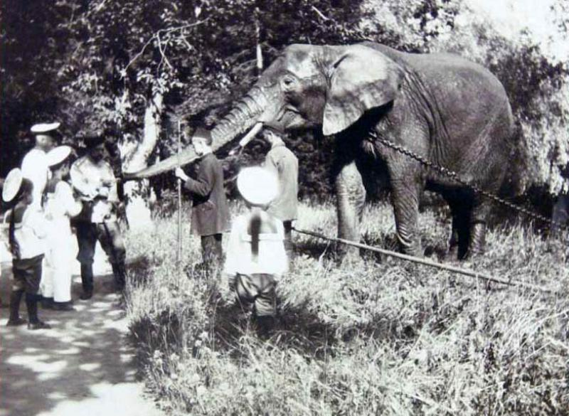

## Приглашаем вас прогуляться по Александровскому парку, посетить несколько промежуточных точек и в конце найти самый настоящий клад) ##

- В целях экономии времени местонахождение объектов в промежуточных точках вы можете вычислить дома.  
- Возьмите с собой карту парка, бумагу и ручку (их с успехом заменит смартфон) и по возможности непромокаемую обувь (её смартфон не заменит) - кое-где в парке ещё лежит снег.  
- Рекомендуем оставить машину на стоянке в точке 59°43'41"N 30°21'24"E.

**Промежуточные точки:**  
1. В этом, наверное, самом известном видео, снятом в 90-е в Александровском парке, гуляют с магнитофоном три друга.  
По легенде съемки происходили в день рождения одного из героев клипа, причем позвали его на съемки в этот же день, когда он резал салатики у себя на кухне. К счастью, он не отказался.  
Сколько досок в ширину насчитывает в центральной части наиболее часто встречающийся в клипе мост (Имейте в виду, в 2010-х мост реставрировали)? Это цифра **A**.

2. Посмотрите на фото и восхититесь этим прекрасным зданием. А потом проследуйте туда, где оно стоит сейчас, и сосчитайте количество чугунных фонарных столбов на его огороженной территории. Это цифра **B**.

3. Это здание построено в 1821-1827 годах по проекту архитектора Менеласа, для сыновей императора. В нем дети занимались военными и гимнастическими упражнениями.  
Вас интересует количество ниш, в которых буквально до последней реставрации стояли рыцари, на первом ярусе здания. Это цифра **C**.

4. Как ни странно, но данное фото сделано в Александровском парке. Место жительства этих животных располагалось рядом с одним из входов в парк. Со временем данный вход стали называть в честь этих животных.  
Сосчитайте количество фонарей на белой ограде в данном месте. Это цифра **D**.

5. Вопрос: количество колонн у центрального входа в главную постройку Александровского парка (полуколонны и пилястры не считать:). Это число **E**.

6. На территории Александровского парка присутствует несколько захоронений, среди которых даже есть полноценное кладбище с более чем 110 могилами. Правда, похоронены там не люди. К сожалению, посетить его сейчас не возможно, можно только осмотреть через забор.
Количество окон в верхнем ярусе круглой башни здания рядом с этим кладбищем даст вам цифру **F**.

7. Данное место в Александровском парке часто ошибочно называют Готической башней. Настоящее же его название совсем другое.  
Вопрос: количество зубчиков на гребне петуха на оригинальном флюгере. Это цифра **G**.

8. На тезке этой горы жили следующие девушки: Каллиопа, Эвтерпа, Мельпомена, Талия, Эрато, Полигимния, Терпсихора, Клио, Урания.  
Конечно, кататься на санках с горы не рекомендуется, о чем поставлены предупредительные таблички.  
Но если всё-таки скатиться в сторону братской могилы жертв Октябрьской революции, о сколько **пар** деревьев можно ушибиться? Число **пар** деревьев - цифра **H**.

Финальная точка находится по координатам 59°(**G**)(**A**-**D**-**H**)'(**B**+**H**)(**C**+**H**)"N 30°(**D**)(**H**)'(**E**-**C**-**F**)(**A**+**D**)"E, вы её не пропустите. Клад закопан под ближайшим пнем к точке.

***

Будут вопросы с поисками - звоните, пишите [+7-904-3345008](tel:+79043345008) Алексей
